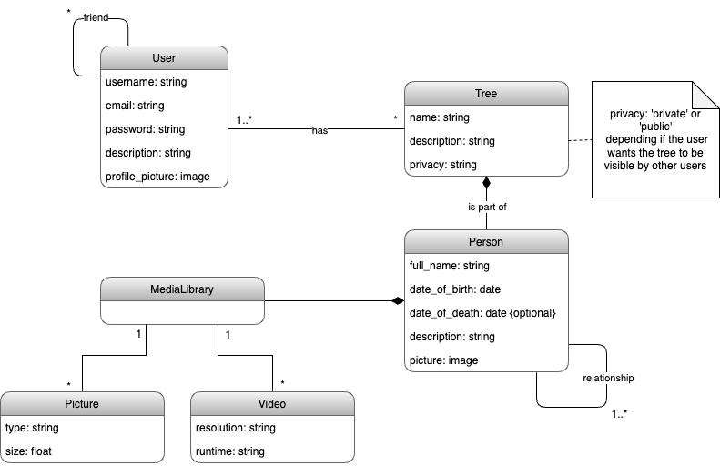

## Requirements

### Domain Model

#### User
The User class represents the person/people who use the app on a daily basis. The app has an authentication system, therefore an user needs a username, email and password to fully access the application. On their profile, the user will be able to edit his/her description and upload a profile picture if he/she so wishes to do so.

#### Trees 
The main feature of our app will be the possibility to create genealogy trees has big has the user wishes. As the costumer can build an unlimited (so far) ammount of trees, the multiplicity shall be infinite instances. The User side multiplicity is one or more instances, because the app will allow the original creator of the tree to invite other users to create the tree with him/her. A tree can have a name and a brief summarization of what it contains.

#### Leaves
The leaves and the tree have a relation of Composition, because the leaves cannot exist without the creation of the tree itself. The leaves act for the members of the family of the tree. Therefore, a leaf holds information about the person that it represents, such as full name, date of birth, date of death if it exists,
a caption and an image if the creator wants to upload one.
